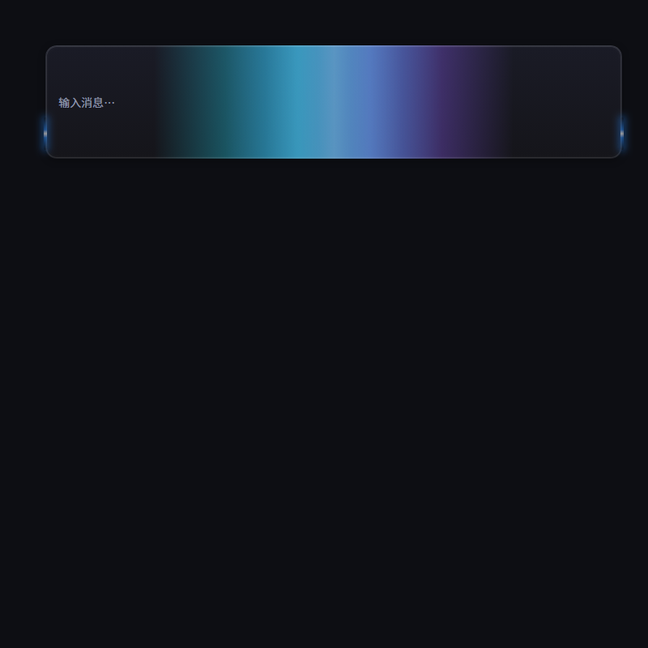

# dsh-input-skin · DSH 输入框皮肤

> DeepSeek Harness (DSH) Web UI 输入框皮肤插件：跟随当前皮肤主题，给输入框加一套「科技风灯光剧场」。



## ✨ 特性

输入框（composer）有三层动画，节奏互相咬合：

| 层 | 效果 | 节奏 |
| --- | --- | --- |
| **顶部边框** | 两段 40px 线段光从顶边中间出发，沿边框**圆角弧线平滑转弯**反向巡游一整圈（顶边水平滑行 → 角上 45° 弧线 → 侧边垂直下行 → 底部交错 → 返回顶中） | 16s / 圈 |
| **线段颜色** | 青 → 蓝 → 紫 循环，渐变浓度随循环加深 | 4s / 圈 |
| **内部光束** | 青 + 紫两道宽光束从中间向两侧扩散再收回；大周期配色：青紫 ×2 遍 → 红蓝 ×2 遍 → 往复 | 6s / 来回，24s / 大周期 |
| **呼吸** | 线段与内部光同步呼吸脉动（缩放/明暗） | 2.4s |

- 全部为 CSS 动画（`background-position` / `transform: rotate` / `@property` 自定义属性驱动颜色），零依赖、零 JS 逻辑，性能友好。
- 颜色全部用 `color-mix` 跟随 DSH 皮肤主题变量，换肤自动适配。
- 在 **设置 → 通用** 中提供开关，一键启停。

## 📦 安装

DSH 插件通过 `pnpm add link:<本地路径>` + `cordis.patch.yml` 挂载（参考 [DSH 插件开发文档](https://github.com/deepseek-ai/deepseek-harness)）。

```bash
# 1. 克隆 / 下载本仓库到本地（如 ~/dsh-plugins/dsh-input-skin）

# 2. 在 DSH web 插件目录安装
cd <dsh-web 目录>
pnpm add link:<本仓库路径>
```

在 `~/.dsh/profiles/web/cordis.patch.yml` 中追加挂载：

```yaml
- insert:
    - id: dsh-input-skin
      name: '@linxin666/dsh-input-skin'
```

重启 DSH web，进入 **设置 → 通用 → 输入框皮肤** 开启即可。

> 注意：`lib/client.js` 由浏览器实时读取，修改源码后刷新页面（建议 Ctrl+F5）即可生效，无需重启服务。

## 🎛️ 可调参数

所有参数都在 `lib/client.js` 顶部的 CSS 模板里，改一处刷新即生效：

| 参数 | 位置（搜索关键词） | 默认 |
| --- | --- | --- |
| 巡游速度 | `dsh-flow-path 16s` | 16s 一圈 |
| 线段长度 | `.dsh-role-flow-a` 的 `width:40px` | 40px |
| 颜色循环速度 | `dsh-seg-color 4s` | 4s |
| 颜色浓度 | 渐变里 `color-mix(..., 20%, transparent)` | 20% |
| 角半径（转弯弧度） | `gen-flow.mjs` 锚点 `2.5%` | 卡片宽 2.5% |
| 内部光束宽度 | `background-size: ... 50% 100%, 50% 100%` | 各 50% |
| 配色大周期 | `dsh-beam-color 24s` + 各关键帧色值 | 青紫×2 → 红蓝×2 |

## 🗂️ 目录结构

```
dsh-input-skin/
├── lib/
│   ├── index.js        # host 半区（最小实现）
│   └── client.js       # 全部 CSS 动画 + 设置开关注入
├── gen-flow.mjs        # 边框巡游圆角路径生成脚本（Node）
├── test-preview.html   # 本地预览页（浏览器直接打开即可看效果）
├── cordis.patch.yml    # DSH 挂载配置示例
└── package.json
```

## 🛠️ 技术要点

- **平滑转弯**：巡游路径由 `gen-flow.mjs` 生成 37 个关键帧，线段中心沿圆角弧线走，`transform: rotate` 随路径切线连续旋转（全程单向递增 540°→900°，闭环无缝）。
- **颜色循环**：`@property` 注册 `<color>` 自定义属性 + `var()` 引用，颜色在渐变里平滑插值（避免 `hue-rotate` 滤镜动画在某些环境不推进的问题）。
- **主题适配**：`color-mix(in srgb, var(--dsw-alias-*, #fallback) x%, ...)` 跟随 DSH 皮肤。

## 📄 License

[MIT](LICENSE) © AshModeling
